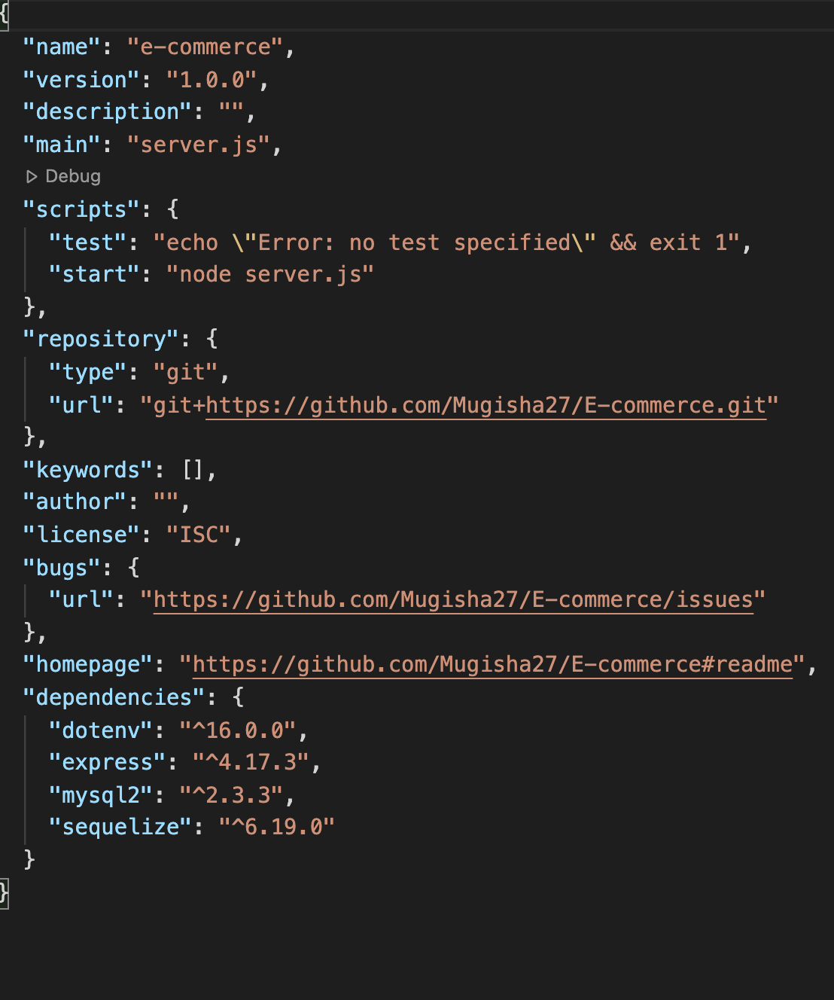

AS A manager at an internet retail company
I WANT a back end for my e-commerce website that uses the latest technologies
SO THAT my company can compete with other e-commerce companies

## DESCRIPTION
 Application that allows users to update, add or remove products and tags using  GET, POST, DELETE, and PUT methods.

## TABLE OF CONTENTS
- [INSTALLATION](#installation)
- [USAGE](#usage)
- [LICENSE](#license)
- [QUESTIONS](#questions)

## INSTALLATION
Connects to a MySQL database using the MySQL2 and Sequelize packages.
Stores sensitive data, like a user’s MySQL username, password, and database name, using environment variables through the dotenv package.
Syncs Sequelize models to a MySQL database on the server start.

    

## LICENSE

The license included for the project is under MIT License

## CHALLENGES FACED
Being able to upload all the media files into the Readme file

## FUTURE DEVELOPMENTS
Not much beside being somehow comfortable creating a project as such.

## QUESTIONS
If you have any further questions about this module or improvement ideas, please feel free to connect on either GitHub or LinkedIn, or email me at:
* GitHub: https://github.com/Mugisha27
* LinkedIn: https://www.linkedin.com/in/chris-mugisha-b7120413b/
* E-Mail: mondclear@gmail.com